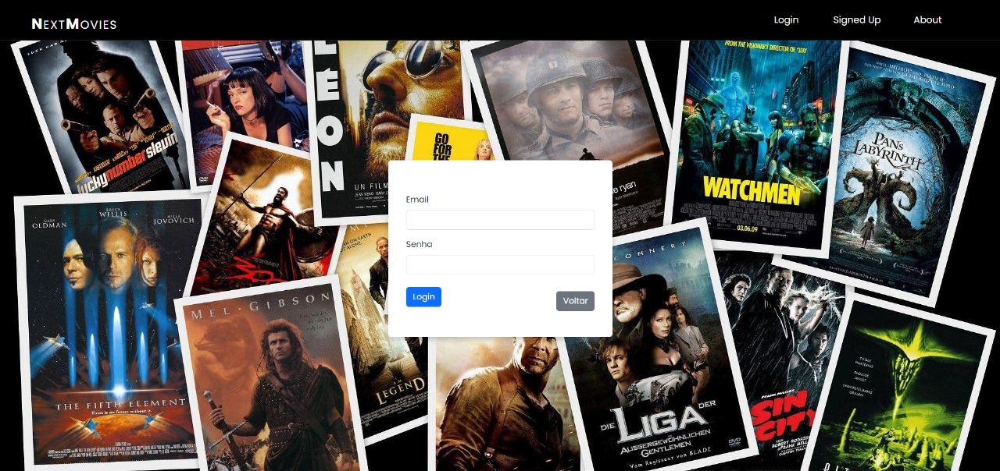
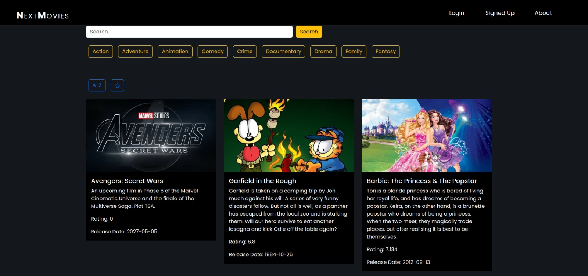
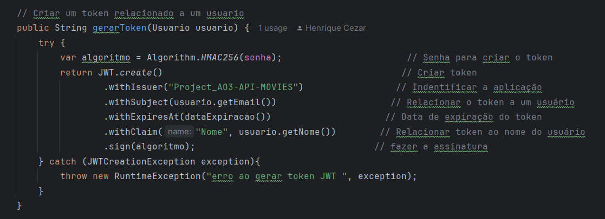
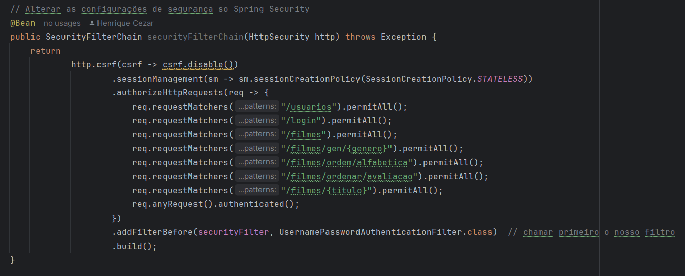

<h1 style="text-align: center;">
  Next Movies 
  
</h1>



## Conceito

**Next Movies é uma aplicação backend desenvolvida em Java com Spring Boot que consome 
a API do TMDb (The Movie Database) para buscar informações sobre filmes. 
A aplicação permite que os usuários pesquisem filmes, salvem os resultados das 
pesquisas no banco de dados, criem contas, façam login com autenticação via tokens,
favoritem filmes, removam favoritos e selecionem um filme aleatório da lista de 
favoritos para assistir.** <br>
<br>



## Funcionalidades 📝

- **Busca de Filmes**: Utiliza a API do TMDb para pesquisar e exibir informações sobre filmes.
- **Autenticação de Usuário**: Sistema de criação de conta e login com tokens JWT para autenticação.
- **Gerenciamento de Favoritos**: Usuários podem favoritar e remover filmes da lista de favoritos.
- **Seleção de Filme Aleatório**: Funcionalidade para selecionar um filme aleatório da lista de favoritos para assistir.
- **Tratamento de Erros HTTP**: Tratamento adequado de erros HTTP com respostas informativas para o cliente.

## Tecnologias Utilizadas 🖥️
[](https://spring.io/)
[](https://spring.io/projects/spring-security)
[](https://www.mysql.com/)
[](https://jwt.io/)
[](https://openjdk.java.net/)


- **Linguagem de Programação**: Java
- **Framework**: Spring Boot
- **Banco de Dados**: MySQL
- **Autenticação**: JWT (JSON Web Tokens)
- **API de Filmes**: TMDb (The Movie Database)

## Criação do Token JWT 🔑

Abaixo está um exemplo de como é feita a criação do token JWT no nosso projeto:



Neste exemplo, mostramos a geração do token JWT com base nas credenciais do usuário e o retorno para o cliente.


## Controle de Acesso 🔒

Abaixo está um exemplo de como é o controle de acesso na nossa aplicação:




## Como Contribuir 🚀

Se você gostaria de contribuir para este projeto, siga os passos abaixo:

1. **Fork** o projeto.
2. Crie uma nova branch com sua feature:
```bash
git checkout -b minha-feature
```
Commit suas mudanças:
```bash
git commit -m 'Adiciona minha feature'
```
Push para a branch:
```bash
git push origin minha-feature
```
Envie um Pull Request explicando suas alterações. <br><br>
**Agradecemos sua contribuição!** 🎉


## Nosso time 👩‍💻👨‍💻

- **Isadora (Adora)**: Desenvolvimento FrontEnd 💻
- **Henrique (Henriquix20)**: Desenvolvimento BackEnd e Banco de Dados 🛠️
- **Gabriel (Gabs)**: Planejamento e Estruturação do Tema 📊
- **Weslley (São Gonçalo)**: Ideias e Inovações 💡


 
